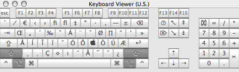
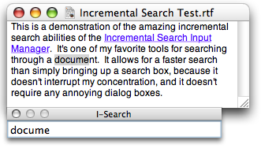
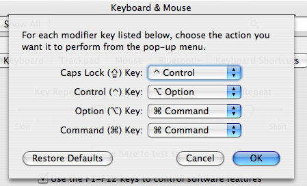

Customizing the Cocoa Text System
=================================

  Version 0.8  
  by [Jacob Rus][me]  
  Monday, 20 March 2006

[me]: http://hcs.harvard.edu/~jrus

Apple's Cocoa text system is a complicated beast, but also extremely flexible,
and with a bit of work, it can be molded to match many working styles. This
how-to covers the 2 major ways of customizing the text input system: Default
key bindings, and for still more control, input managers.

I'm writing this guide because nothing like it currently exists. There is
incredible room for flexibility in customizing the Cocoa text environment, but
most users--even power-users--have no idea of the available options. This is
mostly because Apple's documentation is 1) aimed at developers, and 2) often
incomplete or ambiguous. Most users have no idea that they can look at a file
which describes all of the shortcuts on the system, and that they can easily
add their own shortcuts, or replace existing ones with differing
functionality.

For instance, one of the most common complaints from new Windows and
Linux/Unix switchers is that many of the shortcuts they are used to, such as
using the Home and End keys to move to the beginning, respectively end, of a 
line or document, don't work as they expect in OS X.

For new users, almost every text box you use is a Cocoa text box (or close
enough to act the same as far as we're concerned) -- Safari web form boxes,
the text field in iChat for sending new messages, the documents in Pages or
TextEdit, the email composer in Mail, etc. **Note:** Some text boxes are not
Cocoa however, so the tricks in this article still aren't completely
universal. Notably, Microsoft Word, Adobe applications, AppleWorks, and the
text fields in Camino and Firefox won't work with this hint.

I expect that all users of OS X can get something out of this guide. I'm
starting with the basics, so that new users, unfamiliar with the terminal and
the intricacies of OS X can be brought up to speed. But even the most
experienced users should hopefully learn something from this article; I know
I learned several new nifty things while writing it.

**Disclaimer**: it is possible, when mucking around with the text system, to
send applications messages they aren't expecting. This can cause them to
crash. As long as you stick to standard text selectors, you should be fine,
but I'm not responsible if your program crashes because of a binding you add.

Terminology
-----------

Before delving too deeply into the intricacies of the Cocoa text system, it
helps to understand some programmer jargon.

  * The **_[Insertion Point][wp-insertion]_** (sometimes called the *caret*)
    is the blinking vertical line that shows where text typed into a text box
    will show up.

  * A **_Buffer_** is the text field currently being edited. This might be a
    text box in an online form in Safari, or the main window in TextEdit.

  * **_[Key Bindings][wp-bindings]_**, often called 'keyboard shortcuts',
    define what happens when any key is typed in an application. For instance,
    in a Mac text editor, the 'a' key inserts an `a`, 'Opt-e, e' inserts an
    `é`, and 'Ctrl-a' moves the insertion point to the beginning of the
    current line.

  * A **_[String][wp-string]_** is a chunk of text, literally a 'string' of
    letters.

  * A **_[Method][wp-method]_** is a function that an object (which includes
    just about everything in Cocoa) can perform.

  * A **_Selector_** is the name of a method. It is a string. Something like
    `"insertTab:"`, or `"save:"`

  * The **_Mark_** is an invisible point somewhere in the document, which can
    be set, and then returned to. Marking is the way regions of text were
    selected in UNIX text editors back in the days before they could be
    highlighted in blue with a mouse drag.

  * To **_Kill_** some text is basically the same as using the 'Cut' command,
    but in OS X uses a separate mechanism, that is localized to the current
    buffer. By default 'Ctrl-k' kills everything after the insertion point on
    the current line.

  * **_Yank_** is the analog of the 'Paste' command. By default, 'Ctrl-y'
    yanks back whatever was most recently killed.

[wp-insertion]: http://en.wikipedia.org/wiki/Insertion_point
[wp-bindings]: http://en.wikipedia.org/wiki/Keyboard_shortcut
[wp-string]: http://en.wikipedia.org/wiki/String_%28computer_science%29
[wp-method]: http://en.wikipedia.org/wiki/Method_%28computer_science%29

Many of these terms crop up in the venerable [Emacs][emacs] editor, so reading
about them in the Emacs context can be enlightening: [Buffer][em-buffer],
[Key Bindings][em-bindings], [Mark][em-mark], [Kill][em-kill]

[em-buffer]: http://www.cs.cmu.edu/cgi-bin/info2www?(emacs)Buffers
[em-bindings]: http://www.cs.cmu.edu/cgi-bin/info2www?(emacs)Key%20Bindings
[em-mark]: http://www.cs.cmu.edu/cgi-bin/info2www?(emacs)Mark
[em-kill]: http://www.cs.cmu.edu/cgi-bin/info2www?(emacs)Killing
[em-yank]: http://www.cs.cmu.edu/cgi-bin/info2www?(emacs)Yanking

Existing (Default) Functionality
--------------------------------

Most users of Mac OS X, even long-time Apple geeks, know only a fraction of
the available text system shortcuts. This is a tragedy, as they are consistent
across all applications which use the Cocoa text system, including TextEdit,
Mail, iChat, Safari, and countless third-party applications.

### Simple Text Insertion ###

One thing every user knows is that when a plain letter is typed (assuming the
input method in use matches the keyboard), that letter is inserted into a
selected text box. When the shift key is held down, letters are capitalized,
and symbol keys input the second symbol shown on them. For instance 'Shift-]'
inputs the '}' character.

It is possible to see all of the possibilities using the
'[Keyboard Viewer][apple-kv]' palette:

[apple-kv]: http://www.apple.com/macosx/tips/keyboard11.html

In addition, the option key, both alone and in conjunction with the shift key,
will change the characters inserted. So 'Option-y' inserts a '&yen;' currency
mark, and 'Option-Shift-c' inserts a capital cedilla: '&Ccedil;'. We can see
how option affects our input options using the Keyboard Viewer:

Users with full keyboards have a complete number pad, with an enter key
(instead of return), and symbols used in arithmetic. This number pad is
available to PowerBook and iBook users as well. The numlock key (Fn-F6),
enables the small symbols printed at the lower right corner of powerbook keys
to be input. But even more usefully, those keys can also be used as a number
pad while the Fn key is held down. This is great for typing lots of numeric
data, and also comes in handy when playing games that allow vertical,
horizontal, and diagonal movement via the number pad:

Of course, there are a number of standard actions that the above pictures
don't show.  For instance, when you type 'Command-left', the insertion
point moves to the beginning of the current line.  Also, OS X has a fairly 
large number of unix/emacs bindings built in.

The complete list of these extra commands takes up too much space for this 
page, so I've made them into a [separate document](system-bindings.html).

Default key bindings
--------------------

OS X has three main files which specify the key bindings used by Cocoa
applications:

    /System/Library/Frameworks/AppKit.framework/Resources/StandardKeyBinding.dict

    /Library/KeyBindings/DefaultKeyBinding.dict

    ~/Library/KeyBindings/DefaultKeyBinding.dict

which contain, respectively, the default 'built-in' key bindings, system-wide
custom keybindings, and a user's personalized key bindings. Don't edit the
built-in `/System/Library/` file, as this could seriously hose your machine.
Note that as usual, personalized bindings override the built-in standards.

If the `DefaultKeyBinding.dict` file doesn't exist, don't worry. Simply making
a `KeyBindings` folder in `~/Library`, and then adding a new text file should
do the trick.

### File Format: ###

This file is a normal [Property List][appledev-plist], which can be created
either with a text editor, such as [TextWrangler][t-w], [Smultron][smultron],
or [TextMate][t-m], or with Apple's Property List Editor, which is installed
with the developer tools. Property lists are pervasive in OS X, and are used
for all sorts of configuration files, and preferences. Any file which has a
`.plist` or `.dict` extension is a property list. Every application has an
`info.plist` file inside of it which tells OS X what types of files that
application can handle. Smart folders (`.savedSearch` files) are property
lists. The `defaults` command, which can be run from the terminal, is a quick
way to edit single items in a property list.

There are two types of property lists, old-style NeXT text files, and newer
XML formatted files. I will use the old-style plists in this how-to, because
they are easier to read and understand; they are more compact, with less
distracting markup.

**The NeXT property list format** is a file format that can describe, using
plain text, all of the objects used in Cocoa programs. We specifically care
about 3 types: 'strings', 'lists', and 'dictionaries':

  * A *string* is simply a sequence of letters, numbers, and symbols,
    such as:
    
        "this is a string with some $#@! symbols"

  * A *list* is, like it sounds, a list of other objects, such as
    lists or strings:
    
        ("a", "list", "can", "contain", "many", "strings")

  * A *dictionary* contains pairs of "keys" and "values".  Basically,
    dictionaries provide a way to name a bunch of objects, and refer
    to them by name.  Note that while dictionary keys must be strings,
    the values can be any type of object.
    
        {"key1" = "value1"; "key2" = "value2"; "key3" = ("a", "list");}

  * In addition, *comments* can be added to old-style property lists
    by enclosing some text in `/*` and `*/`

Every property list has a root dictionary object, which can contain
sub-objects. A simple plist file might look like:

    {
        /*  ** THIS IS A COMMENT: **
         * 
         * Notice that each line in the dictionary has a 'key' string,
         * and a 'value', which can be a string, a list, or another
         * dictionary.
         */
        
        "My String" = "Hey there!";
        
        "My List" = ("first string", "second string", "final string");
        
        "My Dictionary" = {
            "Sub-string A" = "This is a string inside a dictionary";
            "Sub-list B" = ("This is a list", "inside a dictionary");
        };
    }

This property list has three key-value pairs: a string, a list, and a
dictionary.

### The format of DefaultKeyBinding.dict ###

The `DefaultKeyBindings.dict` file is fairly straight-forward. It is a normal
property list, which as keys, uses the requested key bindings, and as values
uses the commands they should execute. For instance, I might want the letter
`a` to not type 'a', but instead insert a tab. If I put the following in my
`DefaultKeyBinding.dict`, then all Cocoa apps launched afterwards will insert
a tab key instead of an `a`:

    {
        /* This will make all a's turn to tabs.  Beware. */
        "a" = "insertTab:";
    }

#### How to represent bindings ####

But of course, if we could only bind things to letter keys, this wouldn't
really be so useful, now would it? Fortunately, Apple's engineers made sure
that every key that you could possibly ever type can be put into a binding.

The way it works is simple. For lower-case and capital letters, simply type
the letter into the string. So `"y"` represents the 'y' key, while `"T"`
represents 'Shift-t'. For numbers and symbols, including space, the same
holds. So `"!"` represents 'Shift-1', or however you type '!' on your keyboard
layout. To add modifier keys, add a symbol corresponding to that modifier:

>   `"@t"` = Command-t  
>   `"^t"` = Control-t  
>   `"~t"` = Option-t  
>   `"@^T"` = Command-Control-Shift-t  
>   `"~ "` = Option-space

For numbers and symbols, to add the shift key is not as easy as typing a
capital letter, so `$` stands for shift. Also, there is a difference between
numbers above the letter keys, and numbers on the keypad. To indicate keypad
keys, use `#`:

>   `"@$#5"` = Command-Shift-Numpad 5  
>   `"^6"` = Control-6

**Note:** Lots of bindings with the Command key won't work.  This is done by
Apple to ensure that applications can use these shortcuts for themselves, and
not worry about user key bindings.  Some will work, however, such as
'Command-right arrow'.

There are still 2 limitations: First, what do we do if we want to bind a
literal '@' or '#' symbol? We *escape* it! By adding a `\\` before the symbol,
we can avoid this. At the moment, the only way I can get ‘\’ itself to bind to
anything is by writing it as ‘\\U05C’.

>   `"~\\$"` = Option-$    

Second, if we were limited to symbols and modifiers, we would still cut off
keys like 'delete', 'tab', and 'esc', so any keys that aren't already covered
can be entered using their unicode values:

#### Unicode values for Apple non-letter keys: ####

<table>
<tr><td>Escape:</td>        <td><code>\U001B</code></td></tr>
<tr><td colspan=2>&nbsp;</td></tr>
<tr><td>Tab:</td>           <td><code>\U0009</code></td></tr>
<tr><td>Backtab:</td>       <td><code>\U0019</code></td></tr>
<tr><td colspan=2>&nbsp;</td></tr>
<tr><td>Return:</td>        <td><code>\U000A</code></td></tr>
<tr><td>Enter:</td>         <td><code>\U000D</code></td></tr>
<tr><td colspan=2>&nbsp;</td></tr>
<tr><td>Delete:</td>        <td><code>\U007F</code></td></tr>
<tr><td colspan=2>&nbsp;</td></tr>
<tr><td>Up Arrow:</td>      <td><code>\UF700</code></td></tr>
<tr><td>Down Arrow:</td>    <td><code>\UF701</code></td></tr>
<tr><td>Left Arrow:</td>    <td><code>\UF702</code></td></tr>
<tr><td>Right Arrow:</td>   <td><code>\UF703</code></td></tr>
<tr><td colspan=2>&nbsp;</td></tr>
<tr><td>Help:</td>          <td><code>\UF746</code></td></tr>
<tr><td>Forward Delete:</td><td><code>\UF728</code></td></tr>
<tr><td>Home:</td>          <td><code>\UF729</code></td></tr>
<tr><td>End:</td>           <td><code>\UF72B</code></td></tr>
<tr><td>Page Up:</td>       <td><code>\UF72C</code></td></tr>
<tr><td>Page Down:</td>     <td><code>\UF72D</code></td></tr>
<tr><td colspan=2>&nbsp;</td></tr>
<tr><td>Clear:</td>         <td><code>\UF739</code></td></tr>
<tr><td colspan=2>&nbsp;</td></tr>
<tr><td>F1:</td>            <td><code>\UF704</code></td></tr>
<tr><td>F2:</td>            <td><code>\UF705</code></td></tr>
<tr><td>F3:</td>            <td><code>\UF706</code></td></tr>
<tr><td>...</td>            <td></td></tr>
<tr><td>F35 </td>           <td><code>\UF726</code></td></tr>
<tr><td colspan=2>&nbsp;</td></tr>
<tr><td colspan=2><em>Not on Apple keyboards:</em></td></tr>
<tr><td colspan=2>&nbsp;</td></tr>
<tr><td>Menu:</td>          <td><code>\UF735</code></td></tr>
</table>

**Notes:**

  * 'Backtab' is 'Shift-Tab'
  * The key labeled 'Backspace' on most PC  keyboards is the 'Delete' key
  * The 'Num Lock' key on PC keyboards is 'Clear'
  * The keys labeled 'Print Screen', 'Scroll Lock',  and 'Pause' are 
    respectively 'F13', 'F14', and 'F15'
  * The key labeled 'Insert' is the 'Help' key
  * I'm not sure whether the 'Menu' key actually does anything, as I don't own 
    a keyboard with that key on it.

For a complete list, including some keys that aren't on current apple 
keyboards, but can still be used by OS X, see the [Registry][apple-ucode]
of Apple Unicode corporate-zone characters.

In general, the best way I've found to discover key's escape codes is to use
the free [Key Codes][keycodes] application from Peter Maurer. The app brings
up a floating palette which prints a log of all the keys typed.

[keycodes]: http://www.petermaurer.de/nasi.php?section=keycodes

#### More complicated bindings and actions ####

Of course, sometimes we wish we had more keys on the keyboard. Even with all
of the modifier keys, it gets hard to keep different functionality separated,
and things get confused. For this reason, it is possible to use
multiple-keystroke bindings. To this end, instead of binding our first
keystroke to a selector, we bind it to a dictionary, containing the second
keystrokes. Emacs, the UNIX-based text editor, has many such
multiple-keystroke bindings. Therefore, as an example of how this can be done,
we will take Emacs bindings, and try to replicate them in Cocoa Text Widgets.

One Emacs command is 'Control-x, u', for 'undo'. Another is 'Control-x,
Control-s' for 'save'. To add this command to our key bindings, we need to
bind 'Control-x' to a dictionary of sub-bindings:

    {
        /* Control-x dictionary */
        "^x  " = {
            "u"  = "undo:";          /* C-x u    =>  undo */
            "^s" = "save:";  /* C-x C-s  =>  save */
        };
    }

Our 'Control-x' parent dictionary can have several multiple-keystroke bindings
associated with it. In this way, we can have whole areas of functionality
given to one 'parent' key binding, with the resulting action to be determined
by a letter. We can effectively have 4 or 5 keyboards for our bindings!

But of course, the number of bindings is not our only limitation so far. We
are also limited by the range of selectors offered by the text box. We often
find ourselves performing complicated actions repeatedly, and would like to
invoke them with single keystroke. Mostly when this happens, Applescript, or
some other programming language is the best solution. On occasion, however,
the text system has enough power and flexibility to do the trick. This is
because, besides single selectors, a binding can also execute a list of
selectors, sequentially.

As an example, imagine that I often want to change paragraphs of text to all
capital letters, but I'm tired of selecting the whole paragraph with my
keyboard or mouse. I want 'Control-Option-u to make my paragraph all
uppercase, and then I want it to start a new paragraph by inserting two new
lines at the end of the paragraph.

This (somewhat contrived) action can be broken into steps: 1. Select paragraph
2. Make all the letters uppercase 3. Move to the end of the paragraph 4.
Insert two new lines.

We can make a plist of these directions:

    {
        "^~u" = ("selectParagraph:",
                 "uppercaseWord:",
                 "moveToEndOfParagraph:"
                 "insertNewline:",
                 "insertNewline");
    }

So, with the the ability to map multiple-keystroke bindings to sets of actions
that can perform complicated behaviors, what's left?

Every time you type a key, the Cocoa text system looks for bindings, and if
none are found for the key, it instead passes the keystroke along as a string
input to the `insertText:` selector. Well, as luck would have it,
[Kevin Ballard][kevin], from the [##textmate][tm-channel] IRC channel on
[freenode][freenode] (a delightful place to chat, incidentally), found a real
gem, that doesn't seem to be documented anywhere on Apple's website, or
anywhere else: **It is possible to use the `insertText:` selector as part of a
binding, and thereby bind an arbitrary string to a keystroke.** If we bind a
key to a list, containing `"insertText:"` as one of its strings, the next
string in the list will be inserted into the text field. Example:

    {
        /* Realize that actually using this will render your a key
           amusingly useless.*/
        "a" = ("insertText:", "some fun text", "moveWordBackward:");
    }

as a DefaultKeyBinding.dict file will make the 'a' key type 'some fun text',
and then move the insertion point to the beginning of the word 'text', instead
of the simply typing an 'a', as usual.

[kevin]: http://kevin.sb.org/
[tm-channel]: irc://irc.freenode.net/##textmate
[freenode]: http://freenode.net/

This is amazingly useful if there are some symbols or strings which must be
entered on a regular basis. For instance, imagine that I sometimes need to
type LaTeX Greek letters, and also sometimes need the associated unicode
symbols (for alpha, beta, etc.). The following `DefaultKeyBinding.dict` could
reduce this load considerably:

    {
        /* Greek unicode letters */
        "^g" = {
            "a" = ("insertText:", "\U03B1");
            "b" = ("insertText:", "\U03B2");
            "g" = ("insertText:", "\U03B3");
            "d" = ("insertText:", "\U03B4"); /*
            ...                               */
        }
        
        /* Greek LaTeX letters */
        "^m" = {
            "a" = ("insertText:", "\\alpha");
            "b" = ("insertText:", "\\beta");
            "g" = ("insertText:", "\\gamma");
            "d" = ("insertText:", "\\delta"); /*
            ...                               */
        }
    }

Now, when I type 'Control-g, a', '&alpha;' will be inserted instead, and when
I type 'Control-m, g', '\gamma' will be inserted, etc.

It seems like this behavior is just an exception, as I haven't found any other
selectors which take an argument, but it's a glorious exception, for which I
can envision some truly creative uses.

For instance, if I want to drive some friends bonkers, I could set
`DefaultKeyBinding.dict` up to [ROT13][wp-rot13] all of my letters, to enable
"typing in code". Or I could set it up to allow typing in [leetspeak][wp-leet]
("1337").

Most obviously perhaps, I could bind common phrases or code snippets to simple
keystrokes. This would allow systemwide text shortcuts without the need for
third-party applications (though the third party applications out there,
notably Peter Maurer's [Textpander][textpander], do a lot more than key
bindings allow).

One binding that I made, and **it's one of my favorites**, allows me to type
html and xml tags with ease. I have Control-shift-h make a starting and tag
pair out of the word I've just finished typing, and put the cursor in the
middle of them. Here's the code:

    {
        /* This command will let Ctrl-Shift-H turn the previous word
         * into an HTML/XML opening and closing tag pair. */
        "^H" = ( "setMark:",
                 "moveWordBackward:",
                 "deleteToMark:",
                 "insertText:", "<",
                 "yank:",
                 "insertText:", ">",
                 "setMark:",
                 "insertText:", "</",
                 "yank:",
                 "insertText:", ">",
                 "swapWithMark:");
    }

Finally, the possibilities for pranks on coworkers, significant others, etc.
is considerable. For instance, we can set the keyboard up to malfunction on a
couple of letters, maybe a 'z' could [say][apple-speech] "you didn't
\*really\* want to type that, did you?":

    {
        "z" = ("setMark:",
               "insertText:",
               "you didn't *really* want to type that, did you?",
               "selectToMark:",
               "speakText:");
    }

[wp-rot13]: http://en.wikipedia.org/wiki/ROT13
[wp-leet]: http://en.wikipedia.org/wiki/Leet
[textpander]: http://www.petermaurer.de/nasi.php?section=textpander
[apple-speech]: http://www.apple.com/macosx/features/speech/

Moving right along, now that we have the idea of how to form our bindings, we
can get to figuring out exactly which selectors are available to us.

### Usable selectors ###

It is hard to figure out exactly which selectors a text box, and more
generally, an application, will respond to. There are a huge number of
options, but they are not all documented in one place. This is partly because
if one object in an application doesn't respond to a particular message, it
will pass the message along to its parent object.

Still, we can find a large number of useful selectors by searching through the
documentation we can find, and testing what the selectors do. The biggest
source of selectors that we might want to use is in the NSResponder class --
see its [documentation][appledev-nsres]. Specifically, we care about the
'Action methods' section. Also, the [documentation][appledev-nstext] for
NSText has some selectors we can use, and many other classes provide useful
selectors as well, such as NSDocumentController and NSWindow.

Because there are so many usable selectors, I'm putting them in a separate
page.  [Here's a link](selectors.html).

### Examples ###

I've put together some examples of how this could be used. To use one of
these, simply rename the file to `DefaultKeyBinding.dict` and plop it in the
`~/Library/KeyBindings` folder. One of the most common uses of custom key
bindings is emulating another operating system or environment, such as Windows
or Emacs or BBEdit:

  * Emacs emulation [key bindings with esc as meta key](KeyBindings/Emacs Esc Bindings.dict)
  * Emacs emulation [key bindings with opt as meta key](KeyBindings/Emacs Opt Bindings.dict)
  * BBEdit emulation [key bindings](KeyBindings/BBEdit Bindings.dict) (far 
    from complete)
  * Windows emulation [key bindings](KeyBindings/Windows Bindings.dict)
    (_I'm still working on this one, if someone has a list of windows
    default key behaviors, email me: jacobolus \[at\] gmail.com_)

Beyond that, it's possible make key bindings as pranks.  That's always fun:

  * [Leet bindings](KeyBindings/Leet Bindings.dict)
  * [Greek bindings](KeyBindings/Greek Bindings.dict)

Text System Defaults
--------------------

Besides making our own key bindings, there are a few other nifty changes we
can apply to the Cocoa text system, using the "defaults" system. Apple's
developer site [tells about them][appledev-text-system-defaults]. Some of
these defaults are for unimplemented features, and are therefore worthless to
us. There are three defaults however which are of interest to us here. They
can be set using the `defaults` terminal command. I will show them applying
globally with the `-g` flag, but it is possible to set them on an application
by application basis, by for instance specifying `com.apple.textedit` instead
of `-g`.

  * `NSTextKillRingSize`
  
    This default sets the size of the kill ring.  It can be set as follows:
    
        defaults write -g NSTextKillRingSize -string 4

    This changes the size of the "kill ring" which large deleted blocks of
    text get copied to. In this case, I have set it to keep track of the 4
    most recent such blocks. This means that this text can be cycled through,
    and won't be lost as soon as more text is killed. An extra binding is
    useful in dealing with a kill ring: `yankAndSelect:`, which cycles through
    the kill ring.

  * `NSRepeatCountBinding`
    
    This one is one of the coolest features of the text system. In emacs,
    pressing "Control-u", and then a number, 94 say, and then any other
    command, will repeat that command 94 times. It is possible to set OS X to
    do the same thing with "Control-u" as follows:

        defaults write -g NSRepeatCountBinding -string "^u"

    Of course, any other binding could be set instead of "Control-u".

  * `NSQuotedKeystrokeBinding`
    
    This default is normally linked to Control-q. It causes the next
    keystroke typed to be passed through the system, without activating any
    bindings.  For example, if the "Option-v" is bound to scroll up in the
    key bindings file, a square root sign -- √ -- can still be entered by 
    typing "Control-q, Option-v".

Input Managers
--------------

NeXT and Apple realized, when they created Cocoa, that many actions could not
be foreseen by their framework developers. The key binding system is great if
we want to stick within the usual sorts of operations on English text, such as
transposing two letters, skipping the end of a paragraph, or upper-casing a
word, and we can combine these simple actions, but sometimes to do what we
want requires more.

An *input manager* is a piece of code which is loaded into every running Cocoa
application. The purpose of an input manager is to extend the text system in
ways not thought of by the application's original programmers.

We've all been hearing of late about how input managers can be used for
nefarious purposes, but as long as they stick to modifying the text system,
they mostly stay out of trouble, and they can be incredibly useful. Two input
managers in particular are quite popular:

  * First,  Mike Ferris's [TextExtras][textextras] extends the Cocoa
    text system in ways that programmers, particularly, will find
    useful.  I haven't spent too much time playing with TextExtras,
    especially since [TextMate][t-m], my editor of choice,
    doesn't quite use the same Cocoa controls as other Cocoa-based
    editors like [SubEthaEdit][s-e-e] and [Smultron][smultron].  But
    TextExtras adds quite a bit to the Cocoa text system, including
    indent wrapping, auto-indentation, showing and selecting matching
    braces, improved completion, and, perhaps most of all, customized
    piping of text through shell commands.  This allows all sorts of
    snazzy behavior (note that editors like [TextWrangler][t-w] and
    [TextMate][t-m] have their own implementations of this feature).

  * Second, one of my favorite text-system extensions is
    [Michael McCracken][mike-mcc]'s [Incremental Search Input Manager][isim] 
    (ISIM).  Here's a [link to a zip-file of the universal binary][isim-univ].
    
    ISIM is an input manager that provides three new selectors for binding in
    our `DefaultKeyBinding.dict` file: `ISIM_incrementalSearch:`, 
    `ISIM_reverseIncrementalSearch:`, and `abort:` (that last one may
    work for other things, I'm not sure).  The idea is pretty simple, but
    incredibly useful.  Basically, when the selector is invoked, a little
    window pops up at the bottom of the current text box.  When you type
    into this little window, ISIM searches through the current document
    searching for text that matches, and selects the first occurrence of
    such text.  Repeatedly invoking the selector flips through any other
    occurrences in the document.  A picture can say this better than I can:
    
    

    The relevant part of my key bindings file looks like this:
    
        /* Incremental search */
        "^s"        = "ISIM_incrementalSearch:";
        "^r"        = "ISIM_reverseIncrementalSearch:";
        "^$g"        = "abort:";
        
  * Finally, for those who can't get enough customization in a straight
    NSTextView, using the techniques described already, Gus Mueller made an
    input manager, described in two [blog][gus-im-1] [posts][gus-im-2], which
    allows the contents of any Cocoa text field to BBEdit. Type the relvant
    key, and your text will pop up in a new BBEdit document. Save, and the
    text in the original text field is updated. It's awesome. According to the
    second post, modifying it to work with any editor which uses the ODBEditor
    suite (used mainly by FTP programs to open remote files in a local text
    editor) would be easy--it's open source.
    
    TextMate, my editor of choice, comes with a similar input manager, I
    believe inspired by the first one.  And the great thing about TextMate's 
    version is that it works in Mail (I'm not sure, but I think Gus's 
    doesn't).  If there's a text editor you like, it's extremely nice to be
    able to edit Safari form fields, emails, and other text using that editor.

[gus-im-1]: http://www.gusmueller.com/blog/archives/2004/2/5.html
[gus-im-2]: http://www.gusmueller.com/blog/archives/2005/12/17.html

Even Lower-Level Hacking: Keyboard Layouts
------------------------------------------

First, we haven't seen any way to remap modifier keys so far.  This can be 
easily accomplished using the Keyboard and Mouse preference pane.  Click the
'modifier keys' button at the bottom of the view, and a nice sheet pops up.
Mine, which I've set to put the keys on a [Model M][wp-modelm] keyboard in the
right places, with 'Control' where it belongs next to the 'A' key, looks like
this:

[wp-modelm]: http://en.wikipedia.org/wiki/Model_M_Keyboard

For even finer control over the keyboard, it is possible to create
[customized keyboard layouts][tn-keylayouts]. These allow any unicode glyphs
to be mapped to the keys on the keyboard, so alternate language scripts can be
entered, etc. This will work across the OS, not just in Cocoa text editors,
but is also a much lower-level change, which means that messing it up could be
much worse. I haven't actually ever used any layouts other than U.S. on my
PowerBook, so I don't know how easy this is. There is a pretty nice GUI
editor for this from SIL called [Ukelele][ukelele].  It has great
documentation, and should be all that is needed to make custom keyboard
layouts.

[ukelele]: http://scripts.sil.org/cms/scripts/page.php?site_id=nrsi&id=ukelele
[tn-keylayouts]: http://developer.apple.com/technotes/tn2002/tn2056.html

Finally, for the truly adventurous, it is apparently possible to go even
lower-level than Ukelele, and patch the [ADB][adb] codes which are registered
by Apple's USB keyboard drivers. I'm not sure exactly which versions of OS
X this works with, and any hacking at this level requires a serious 
disclaimer, as a wrong move here could really mess up your system. But here
[are][snark1] [two][snark2] links at snark.de which discuss such arcane 
trickery. Good luck to any who try this.  This same guy (Heiko Hellweg) also
[made his own][snark3]  keyboard layout, and patched Apple's keyboard drivers
to give himself a meta key:

> "I got myself the Tiger-Version of the ADB Keyboard Driver
> (AppleADBKeyboard-238.3.4) and hacked away in XCode. My current setup uses
> the obnoxious enter key (between the cursor keys and the right command
> key) as the alt modifier (you can do that without a compiler by just
> [fiddling with info.plist][snark1]) and turns the original alt-key on the left
> onto a META key that sends escape in front of every other key as long as
> it is pressed (for this one, i needed to replace 
> ``/System/Library/Extensions/AppleADBKeyboard.kext`` with an actual
> modified binary).
> 
> "Now i can actually type ahead blindly without thinking twice. Contact me,
> if you are interested in using this too."

Needless to say, I wouldn't advise trying this, unless you know what you are 
doing.

[adb]: http://developer.apple.com/documentation/mac/Devices/Devices-203.html
[snark1]: http://www.snark.de/index.cgi/0007
[snark2]: http://www.snark.de/mac/usbkbpatch/index_en.html
[snark3]: http://www.snark.de/index.cgi/0006

Useful Links
------------

*TODO: Much of this list of links is still incomplete*

### Text Editors ###

Free Cocoa text editors for OS X:

  * [TextEdit][textedit] -- Comes on every Mac
  * [Smultron][smultron] -- Clean, simple, Open-source text editor.
    Named after some sort of Scandinavian strawberry.  Can't beat free!

Commercial Cocoa text editors:

  * [TextMate][t-m] -- most awesome text editor ever.  I really can't
    recommend this one enough.  If you type lots of text, whether it's
    C or Python code, [LaTeX][latex], [John Gruber][gruber]'s
    [Markdown][mdown], or anything else, TextMate is amazing.  It uses a 
    different text box than the usual Cocoa one, so not all of the
    things discussed here will work, for instance, tying multiple commands
    to one binding, or using multiple keystroke commands.  Still, TextMate
    allows far more customization than NSText widgets in general, so
    custom system bindings aren't as necessary.
  * [SubEthaEdit][s-e-e] -- Nifty collaborative editor, which allows
    people halfway around the world from each-other to work on the same
    text file at once.  This editor kicks all kinds of ass when it comes
    to collaborative note taking, or pair programming.  It's not too shabby
    for solo programming either.

Non-Cocoa text editors for OS X:

  * [TextWrangler][t-w] -- Excellent (free!) editor from [Bare Bones][b-b].  
    Not Cocoa, so the keybindings described in this how-to won't work,
    but a great Mac citizen nonetheless, with lots of scriptability,
    and excellent documentation.
  * [BBEdit][bbedit] -- [Bare Bones][b-b]'s flagship editor.  $200, or
    $130 as an "upgrade" from the free TextWrangler, or $50 for
    educational users.  Steep pricing, but does most everything you'd
    ever expect a text editor to do, and more.  I think I still like
    TextMate better, but Mac users have sworn by BBEdit for almost as
    long as I've been alive.

### Apple Developer Documentation ###

Apple has some documentation for the key bindings, but all in all it is far
from adequate, especially for regular users, as opposed to competent
Objective-C hackers.

  * [About Key Bindings][appledev-keybindings] -- A brief note.
  * [Text System Defaults and Key Bindings][appledev-text-system-defaults]
    -- A longer explanation of some of the possibilities with key
    bindings, which also shares some cool text system defaults,
    editable from the command line.
  * [The NSResponder class][appledev-nsres] -- The NSResponder
    class is chock full of useful selectors to try to bind keys to.
  * [Text Input Management][appledev-text-input] -- This extensive
    article is far beyond the scope of this guide, and also only
    somewhat relevant.  It details the nitty gritty of the Cocoa
    Text system, including information on how to create your own
    input managers.
  * [Introduction to Property Lists][appledev-plist] -- Apple's
    documentation of the property list format, covering both old-style
    and XML formats.
  * [Registry of Apple use of Unicode corporate-zone characters.][apple-ucode]
    -- not at Apple.com, but this text document tells the unicode values
    of all the control keys we want to put in our bindings.

### Third-party documentation ###

  * Llew Mason's pretty good [explanation][lsmason] of key bindings in OS X
  * A page at [Cocoa Dev][cocoadev] about them
  * A page by 'misaka' at [deepsky.com][deepsky]
  * Shane Celis' description at [gnufoo.org][gnufoo]
  * [An example key bindings file](http://www.algorithm.com.au/files/mac_os_x/DefaultKeyBinding.dict)
  * Michael C Thornburgh has some Vi-ish keybindings at his site,
    [armory.com][armory], in xml plist format.
  * David Pogue's [comparison][pogue] of keyboard shortcuts on Windows and on 
    the Mac.

### Key Bindings Editors ###

  * Gerd Knops's [Key Bindings Editor][kbe] is a Cocoa application which
    allows the viewing and editing of key bindings files. It knows where the
    system, XCode, and TextMate key bindings are, and allows html and plain
    text export. 
  * Mikael Langer's [TextMacro][textmacro] does some stuff which is no
    longer needed... it's an input manager which allows arbitrary text to be
    input with key bindings, and is supposed to provide for multiple sets of
    key bindings which can be swapped out. It is implemented as a preference
    pane.

### Input Managers ###

  * [Incremental Search Input Manager][isim]
  * [TextExtras][textextras]
  * [XML Tag Input Manager][xml-im] -- Annard Brouwer's free input manager
    for selecting XML/HTML tags; it lets your mouse get in on the text system
    action.

### Tangentially-related MacOSXHints hints ###

  * [*Prewrap Lines in Mail.app*][mxh-prewrap] discusses TextExtras, and
    gives an example of an application.  
  * [*Find and replace special characters in Cocoa apps*][mxh-find-replace]
    -- A hint by [Bill Bumgarner][bbum] about `NSQuotedKeystrokeBinding`,
    which is Control-q by default.
  * [Enabling meta-key Emacs shortcuts in Cocoa apps][mxh-emacs] -- this one
    isn't really so tangential: it shows users how to get emacs emulation by
    putting installing a custom keybinding file (the emacs emulation is not
    nearly as complete as ours above ;-) ).
    
[mxh-prewrap]: http://www.macosxhints.com/article.php?story=2002060811285560
[mxh-find-replace]: http://www.macosxhints.com/article.php?story=20021009063151561
[mxh-emacs]: http://www.macosxhints.com/article.php?story=20010729214616497

[textedit]: http://www.apple.com/support/mac101/work/23/
[smultron]: http://smultron.sourceforge.net/
[t-m]: http://macromates.com/
[t-w]: http://www.barebones.com/products/textwrangler/index.shtml
[b-b]: http://www.barebones.com/
[bbedit]: http://www.barebones.com/products/bbedit/index.shtml
[s-e-e]: http://www.codingmonkeys.de/subethaedit/
[emacs]: http://en.wikipedia.org/wiki/Emacs

[latex]: http://en.wikipedia.org/wiki/LaTeX

[textextras]: http://www.lorax.com/FreeStuff/TextExtras.html
[isim]: http://leverage.sourceforge.net/wiki/index.php/Main_Page
[isim-univ]: http://michael-mccracken.net/IncrementalSearchInputManager-universal.zip
[xml-im]: http://homepage.mac.com/annard/FileSharing9.html

[kbe]: http://www.cocoabits.com/KeyBindingsEditor/  
[textmacro]: http://www.mai.liu.se/~milan/TextMacro/

[bbum]: http://www.friday.com/bbum/
[lsmason]: http://www.lsmason.com/articles/macosxkeybindings.html
[cocoadev]: http://www.cocoadev.com/index.pl?KeyBindings
[deepsky]: http://www.deepsky.com/~misaka/MacOSX/KeyBindings.html
[gnufoo]: http://www.gnufoo.org/macosx/macosx.html#emacs
[armory]: http://aldebaran.armory.com/~zenomt/macosx/KeyBindings.html
[pogue]: http://www.missingmanuals.com/pub/a/oreilly/missingmanuals/2003/keystrokes_0103.html

[gruber]: http://daringfireball.net
[mdown]: http://daringfireball.net/projects/markdown/
[mike-mcc]: http://michael-mccracken.net/

[appledev-plist]: http://developer.apple.com/documentation/Cocoa/Conceptual/PropertyLists/PropertyLists.html#//apple_ref/doc/uid/10000048
[appledev-keybindings]: http://developer.apple.com/documentation/Cocoa/Conceptual/InputManager/Concepts/KeyBindings.html#//apple_ref/doc/uid/20001037-DontLinkElementID_2050128a
[appledev-text-system-defaults]: http://developer.apple.com/documentation/Cocoa/Conceptual/BasicEventHandling/Tasks/TextDefaultsAndBindings.html
[appledev-nsres]: http://developer.apple.com/documentation/Cocoa/Reference/ApplicationKit/ObjC_classic/Classes/NSResponder.html
[appledev-nstext]: http://developer.apple.com/documentation/Cocoa/Reference/ApplicationKit/ObjC_classic/Classes/NSText.html
[appledev-text-input]: http://developer.apple.com/documentation/Cocoa/Conceptual/InputManager/index.html
[apple-ucode]: http://www.unicode.org/Public/MAPPINGS/VENDORS/APPLE/CORPCHAR.TXT
